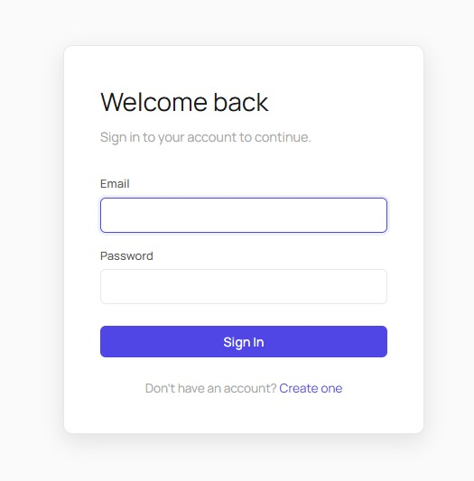
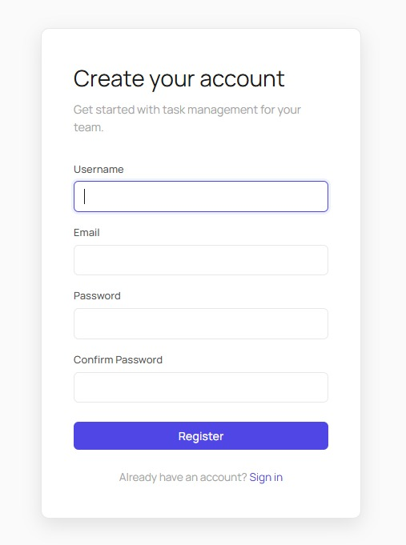
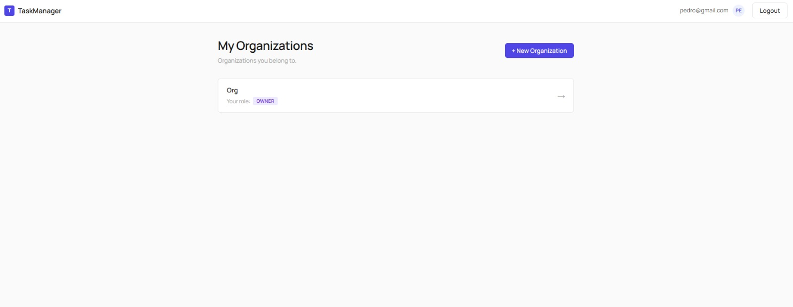
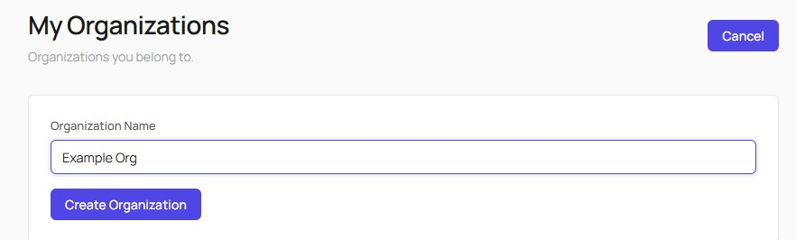
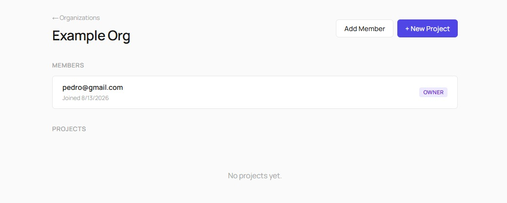
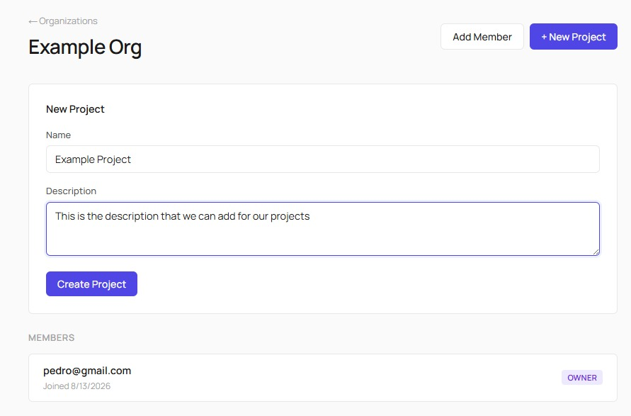
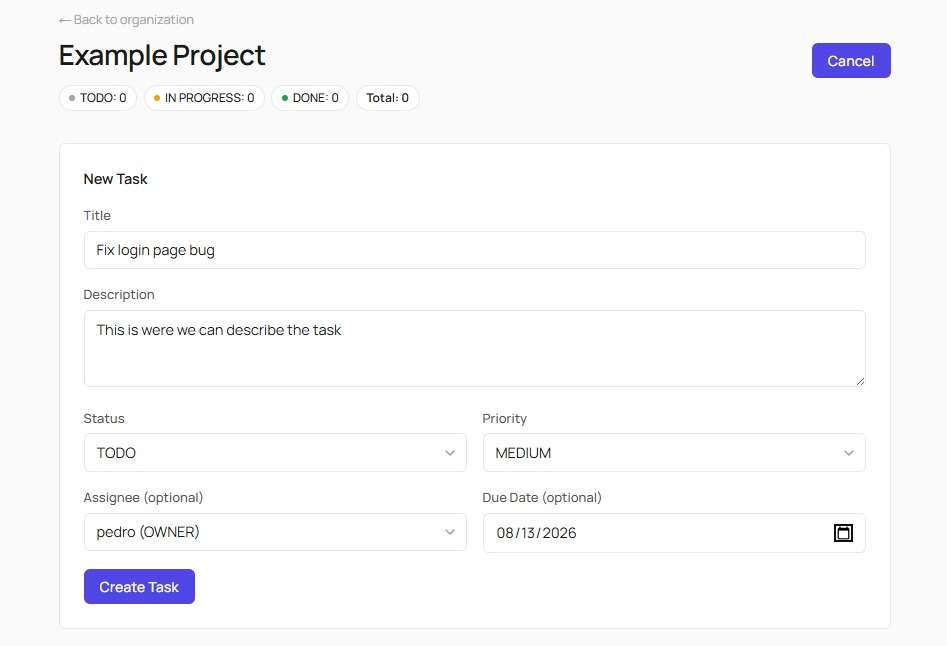
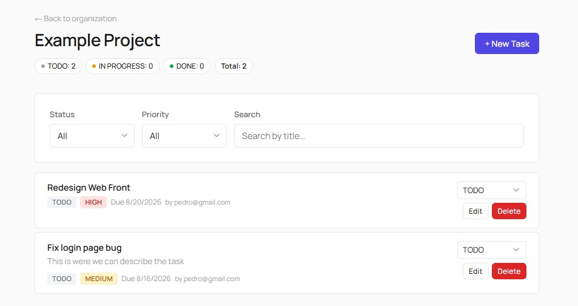
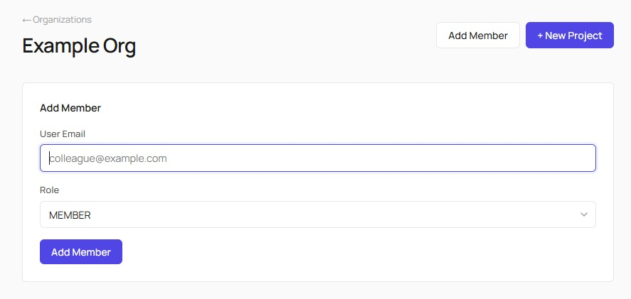
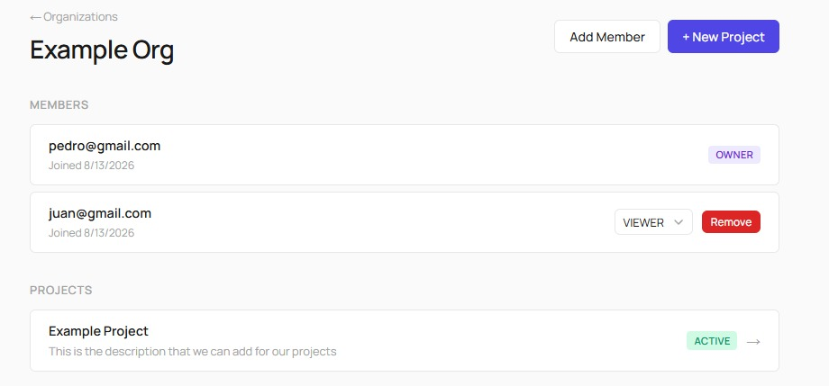

# Project & Team Task Manager

A full-stack task management application with multi-organization support, role-based permissions, and per-project task tracking.

## Table of Contents
1. [How to Run](#1-how-to-run)
2. [Data Model & Roles](#2-data-model--roles)
3. [Technical Decisions](#3-technical-decisions)
4. [Trade-offs](#4-trade-offs)
5. [What I'd Do Differently](#5-what-id-do-differently)
6. [Difficulties Encountered](#6-difficulties-encountered)
7. [Design Q&A](#7-design-qa)

---

## Screenshots

### Sign In


### Create Account


### Main Page (Organization List)


### Create Organization


### Organization View (Projects + Members)


### Create Project


### Create Task


### Task List with Filters & Summary


### Add Member


### Members View (Roles)


---

## 1. How to Run

### Prerequisites
- Python 3.8+
- Node.js 18+
- Git

### Backend

```bash
cd backend

# Create and activate virtual environment
python -m venv venv
# On Windows:
venv\Scripts\activate
# On macOS/Linux:
source venv/bin/activate

# Install dependencies
pip install -r requirements.txt

# Create .env from example
cp .env.example .env
# Edit .env if needed (default values work for local dev)

# Run migrations
python manage.py migrate

# (Optional) Run tests
python manage.py test

# Start the dev server
python manage.py runserver
```

The API will be available at `http://localhost:8000/api/`.

### Frontend

```bash
cd frontend

# Install dependencies
npm install

# Create .env from example
cp .env.example .env

# Start the dev server
npm run dev
```

The frontend will be available at `http://localhost:5173`.

### Docker (recommended)

Both services can be run together with a single command using Docker Compose and the provided Makefile:

```bash
# Build and start both containers (backend + frontend)
make up

# View logs
make logs

# Run backend tests inside the container
make test

# Create a Django superuser
make superuser

# Stop everything
make down

# Full reset (removes containers + volumes)
make clean
```

This spins up:
- **Backend** at `http://localhost:8000` (auto-runs migrations on startup)
- **Frontend** at `http://localhost:5173`

SQLite data persists in a Docker named volume (`backend-data`).

### Environment Variables

**Backend** (``backend/.env``):
| Variable | Default | Description |
|----------|---------|-------------|
| `SECRET_KEY` | dev-insecure | Django secret key |
| `DEBUG` | True | Debug mode |
| `ALLOWED_HOSTS` | localhost,127.0.0.1 | Allowed hosts |
| `CORS_ALLOWED_ORIGINS` | http://localhost:5173 | CORS origins |
| `SIMPLE_JWT_ACCESS_TOKEN_LIFETIME_MINUTES` | 15 | Access token TTL |
| `SIMPLE_JWT_REFRESH_TOKEN_LIFETIME_DAYS` | 7 | Refresh token TTL |
| `DRF_THROTTLE_ANON` | 30/min | Anonymous rate limit |
| `DRF_THROTTLE_USER` | 120/min | Authenticated rate limit |
| `DB_PATH` | db.sqlite3 (local) / /app/data/db.sqlite3 (Docker) | SQLite database path |

**Frontend** (``frontend/.env``):
| Variable | Default | Description |
|----------|---------|-------------|
| `VITE_API_URL` | http://localhost:8000/api | Backend API URL |

---

## 2. Data Model & Roles

### Entity Relationship

```
User (AbstractUser)
 ├── Membership → Organization (many-to-many through Membership)
 ├── Organization.created_by → User
 ├── Project.created_by → User
 └── Task.assignee → User (nullable)
     Task.created_by → User

Organization
 ├── Membership (user, role) — unique_together(user, organization)
 └── Project (organization FK)

Project
 └── Task (project FK)
     ActivityLog (task FK) — [extra: audit trail]

Task
 ├── fields: title, description, status, priority, assignee, due_date
 └── created_by, created_at, updated_at
```

### Roles

| Role | Permissions |
|------|-------------|
| **OWNER** | Everything an ADMIN can do, plus: cannot be demoted/removed (last owner protection) |
| **ADMIN** | Create/edit/delete projects, manage members (add/remove/change roles), edit/delete any task |
| **MEMBER** | Create tasks, edit/delete own tasks, change status of own/assigned tasks |
| **VIEWER** | Read-only access to organization data (projects, tasks, members) |

### Task Edit Rules (Documented)

- The **creator** (`created_by`) of a task or an **ADMIN/OWNER** of the organization can edit or reassign it.
- The **creator**, **assignee**, or an **ADMIN/OWNER** can change the task status.
- A `VIEWER` cannot create, edit, or delete tasks.
- An assignee must be a member of the task's organization (validated in the serializer).

---

## 3. Technical Decisions

### Authentication

I went with JWT through SimpleJWT. The frontend and backend live on different ports during development, so a stateless token avoids the cookie/CORS headache entirely. The access token lasts 15 minutes and the refresh token gets rotated on each refresh. On logout, the refresh token is blacklisted server-side so it can't be reused.

I also considered DRF's built-in Token auth — it's simpler (one token, no refresh), but it hits the database on every request and doesn't let you control token lifetime. For a SPA that can refresh transparently in the background, JWT felt like the better fit.

### Roles

Four roles (OWNER, ADMIN, MEMBER, VIEWER) stored as a simple choice field on the Membership model. With only four options, a separate Role model or a permissions bitfield would be over-engineering. A unique constraint on (user, organization) ensures nobody joins the same org twice.

Role checks happen in two places: the permission class (is this user even allowed to hit this endpoint?) and inside each view's create/update/delete logic (does this specific action require admin?). Keeping both means the permission class blocks unauthorized calls early, and the in-view check handles the finer rules like "only the task's creator or an admin can edit it."

### ViewSets vs API Views

For organizations, members, projects, and tasks I used ViewSets — the CRUD patterns are identical and DRF's router generates clean nested URLs automatically. I picked SimpleRouter over DefaultRouter because the latter generates a root view that conflicts with the organization detail endpoint.

Auth endpoints (register, login, me, logout) are plain API views instead. They return different response shapes — sometimes tokens, sometimes user data — and that kind of thing is easier to control with an explicit view than fighting the ViewSet serializer flow.

### Permission Strategy

Permissions are checked at three levels. First, the queryset: every list/retrieve filters to only the orgs and projects the user belongs to, so even if someone guesses an ID from another organization, the database simply returns 404 — the row is invisible, not forbidden. Second, the permission class: all endpoints require authentication, and member-management endpoints require admin. Third, inside each create/update/destroy: the user's role is checked against the business rules (e.g., a MEMBER can't create projects, only tasks). This catches things the queryset can't — like a member who legitimately belongs to the org but shouldn't have admin powers.

### Frontend Architecture

```
src/
├── api/         — HTTP client + per-domain modules
├── context/     — AuthContext (session, login/logout)
├── components/  — Layout, Spinner, ConfirmDialog, Pagination, etc.
├── pages/       — Login, Register, OrganizationList, OrganizationDetail, ProjectDetail
└── styles/      — Single global CSS file with variables
```

No UI component libraries. Everything is hand-built with vanilla CSS and CSS variables for theming. React Router is the only non-React dependency.

### Activity Log

A separate model records every task mutation (created, updated, status changed, deleted). I write these logs explicitly in the view rather than using Django signals — it's easier to read, easier to test, and I control exactly when a log gets created. The task foreign key uses SET_NULL on deletion, so even after a task is removed, its history sticks around. There's a paginated endpoint to list a project's timeline, but no UI for it yet — that's in the "what I'd do differently" section.

---

## 4. Trade-offs

### localStorage vs Cookies for JWT
**Chosen:** localStorage.

**Pros:** Simple to implement in a SPA; no CSRF concerns; easy to clear on logout.
**Cons:** Vulnerable to XSS — if an attacker can inject JavaScript, they can read the token. In a production app, I'd use httpOnly secure cookies with a SameSite attribute, which would require a CSRF token and a backend that sets/clears cookies. This is the biggest security trade-off in the project.

### Server-side vs Client-side Pagination
**Chosen:** Server-side pagination (DRF PageNumberPagination, 20 items/page).

**Pros:** Consistent payload sizes; works with large datasets; the API returns `count`, `next`, `previous` metadata.
**Cons:** Extra round-trips on page change. For a task manager where lists rarely exceed a few hundred items, this is fine. If lists grew to thousands, I'd add infinite scroll or cursor-based pagination.

### SimpleRouter vs DefaultRouter
**Chosen:** `SimpleRouter` for nested routers.

**Rationale:** `DefaultRouter` generates a root API view at the prefix path (e.g., `/organizations/{slug}/`) which conflicts with the organization detail endpoint. `SimpleRouter` omits this, allowing clean nesting without URL conflicts.

### Monolith vs Microservices
**Chosen:** Django monolith with a React SPA.

The spec says "no microservices." A monolith is the right choice for this scope: one codebase, one deployment, shared auth/permissions logic.

---

## 5. What I'd Do Differently

**Priority 1:** **Move JWT to httpOnly cookies.** This is the most impactful security improvement. Use a CSRF token for mutation requests. This makes the token invisible to XSS scripts, at the cost of added complexity.

**Priority 2:** **Add optimistic concurrency control to tasks.** Currently, two users editing the same task could silently overwrite each other. I'd add an `updated_at` field-based optimistic lock: the client sends `If-Match: <timestamp>` and the server rejects the update if the timestamp differs.

**Priority 3:** **Real-time notifications via WebSocket (Django Channels).** When a task's status changes or a user is assigned, notify all org members in real time. This would require adding Channels, Redis as a channel layer, and a WebSocket client in the frontend.

**Priority 4:** **Activity log UI.** The backend now has the `GET /api/projects/{id}/activity/` endpoint and the `ActivityLog` model (implemented). I'd add a timeline view in the project detail page showing recent changes (task created, status changed, reassigned).

**Priority 5:** **Comprehensive frontend tests.** Add Vitest + React Testing Library tests for the UI, covering critical flows (login → create org → add member → create project → create task → change status). Currently only the backend has automated tests.

---

## 6. Difficulties Encountered

1. **URL routing conflict with nested routers.** Using `DefaultRouter` for nested resources (e.g., `organizations/{slug}/members/`) generated a root API view at `organizations/{slug}/` that intercepted requests meant for the `OrganizationViewSet` detail endpoint. The symptom: PATCH to update an org returned 405 (Method Not Allowed) instead of 200/403, and unauthenticated users got 200 instead of 404. **Fix:** Switched to `SimpleRouter` and reordered urlpatterns so the main router is included before the nested one.

2. **Custom User model must be set before first migration.** Setting `AUTH_USER_MODEL = 'accounts.User'` in settings means Django can't even run `manage.py check` without the model existing. I had to create the accounts app (with the User model) before the scaffold could boot. **Fix:** Created the accounts app and User model as part of the initial scaffold, then fleshed out the endpoints in the next commit.

3. **DRF filter backend defaults.** Setting `DEFAULT_FILTER_BACKENDS` globally to include `DjangoFilterBackend` caused issues on endpoints that don't have defined `filterset_fields`. **Fix:** Only declared `filter_backends` on the `TaskViewSet` where filters are needed, and kept the global setting for consistency.

4. **JWT refresh deduplication on the frontend.** When multiple API calls fail with 401 simultaneously, each could trigger a separate refresh request, causing race conditions and token desynchronization. **Fix:** Added a singleton `refreshPromise` in `client.js` that deduplicates concurrent refresh requests — all 401-retry calls wait on the same promise.

---

## 7. Design Q&A

### a. How would you avoid N+1 when listing tasks with assignee and project in a single response?

Tell the ORM to join related tables upfront instead of fetching them lazily per row. Foreign keys (assignee, project, created_by) can be fetched in a single SQL JOIN. This is already implemented in the task list endpoint — listing 20 tasks makes exactly 1 query.

### b. If the task list grows to tens of thousands per organization, what would you change?

Switch to cursor-based pagination (offset pagination degrades at deep pages). Add compound indexes on commonly filtered columns (project + status, project + assignee). On the frontend, replace pagination with virtualized infinite scroll and cache query results to avoid refetching on navigation.

### c. Where would you validate "don't assign tasks to non-members" — serializer, model, signal, or domain service?

In the serializer (where it's implemented). It has request context, can return a clean field-level error, and integrates naturally with DRF's validation pipeline. The model's clean() isn't called by DRF, signals fire on every save and are hard to test, and a domain service adds indirection without benefit at this scale.

### d. A plausible race condition and how you'd mitigate it.

Two users open the same task. A changes the title, B changes the status. B's request sends stale data and silently overwrites A's change. Fix: optimistic locking — the client sends the `updated_at` it loaded, the server rejects if it doesn't match (409 Conflict). The loser gets a clear "refresh and try again" error instead of a silent overwrite.

### e. If real-time notifications were needed tomorrow, what would you touch first?

Start with Django Channels + Redis on the backend, pushing events to an org group on task changes. On the frontend, open a WebSocket on login that patches the task list in place. Leave out: presence indicators, browser push notifications, multi-user cursors — those add complexity without value for a task manager. The activity log already serves as the persistent record.

---

## API Endpoints Summary

| Method | Endpoint | Permission |
|--------|----------|------------|
| POST | `/api/auth/register/` | Anonymous (5/min) |
| POST | `/api/auth/login/` | Anonymous (5/min) |
| POST | `/api/auth/token/refresh/` | Refresh token |
| POST | `/api/auth/logout/` | Authenticated |
| GET | `/api/auth/me/` | Authenticated |
| GET | `/api/organizations/` | Authenticated (own orgs) |
| POST | `/api/organizations/` | Authenticated |
| GET | `/api/organizations/{slug}/` | Org member |
| PATCH | `/api/organizations/{slug}/` | Org admin |
| GET | `/api/organizations/{slug}/members/` | Org member |
| POST | `/api/organizations/{slug}/members/` | Org admin |
| PATCH | `/api/organizations/{slug}/members/{id}/` | Org admin |
| DELETE | `/api/organizations/{slug}/members/{id}/` | Org admin |
| GET | `/api/organizations/{slug}/projects/` | Org member |
| POST | `/api/organizations/{slug}/projects/` | Org admin |
| GET | `/api/projects/{id}/` | Org member |
| PATCH | `/api/projects/{id}/` | Org admin |
| DELETE | `/api/projects/{id}/` | Org admin |
| GET | `/api/projects/{id}/summary/` | Org member |
| GET | `/api/projects/{id}/activity/` | Org member |
| GET | `/api/projects/{id}/tasks/` | Org member |
| POST | `/api/projects/{id}/tasks/` | Member+ (not Viewer) |
| GET | `/api/tasks/{id}/` | Org member |
| PATCH | `/api/tasks/{id}/` | Creator or Admin/Owner |
| DELETE | `/api/tasks/{id}/` | Creator or Admin/Owner |
| PATCH | `/api/projects/{id}/tasks/{id}/change-status/` | Creator/Assignee/Admin/Owner |

## Tests

46 backend tests covering:
- Auth: registration, duplicate email, password mismatch, login, me endpoint
- Organization permissions: cross-org visibility, member vs admin, auto-owner on creation
- Membership: admin-only management, cannot demote owner, cannot remove last owner
- Project permissions: member/viewer cannot create, admin/owner can, outsider blocked
- Task permissions: viewer cannot create, assignee validation, creator-only edit, status change rules
- Task filters: by status, by priority, search by title, pagination metadata
- Activity log: create/update/status-change/delete generate logs, member can list, outsider blocked

Run tests: `cd backend && python manage.py test`